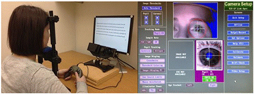

# Eye Tracking Project

Our project is part of the Pro3600 module at Télécom SudParis. You can find detailed information about this module at the following [link](https://enseignements.telecom-sudparis.eu/fiche.php?c=PRO3600).

## Project Overview

Our project, titled *"Eye Tracking,"* focuses on developing an eye-tracking algorithm that can detect and map a user's eye gaze using webcam image recordings. A potential application of this technology is to assist individuals with disabilities, such as those affected by Charcot's disease, who are unable to use their hands for interaction. Our approach involves calibrating the model to track the user's pupil movements. The user initiates the recording module, which displays five red points at different intervals on the screen. The user is prompted to look at these points as they appear.

## Data Collection and Preprocessing

Once the data is collected, we associate the recorded images of the user’s eye with the corresponding $(x_1, y_1)$ coordinates on the screen. These screen coordinates are pixel-wise and adjusted based on the user's desktop resolution, with the origin $(0, 0)$ at the top-left corner of the screen.

Initially, we utilized the OpenCV library and experimented with various methods to segment the user's eye, isolating a cropped image that contains only the eye region. From there, we focused on detecting the pupil, which is critical for precise eye-gaze tracking. We explored shape detection techniques, including the Hough transform, and ultimately determined the center of the pupil's bounding box, defining it as the $(x_0, y_0)$ coordinates.

## Modeling and Regression

Recognizing that the interaction between the eye coordinates $(x_0, y_0)$ and the screen coordinates $(x_1, y_1)$ is complex, we also considered additional interactions and higher-order terms, such as cross-terms $(x_0 y_0)$ and quadratic interactions $(x_0 y_1)$. This led us to fit a quadratic polynomial regression model, which is better suited to capture these non-linearities compared to a simple linear regression.

By including terms like $x_0^2$, $y_0^2$, and $x_0 y_0$, our model is able to account for interactions and subtle patterns that reflect the complexity of eye movements and their projection onto the screen. The regression was fitted using the classical least-squares formula:
$$\beta = (X^T X)^{-1} X^T y$$
where $X$ contains the original and polynomial features, such as $x_0$, $y_0$, $x_0^2$, $y_0^2$, and their interactions. This approach enables us to create a more flexible model, accommodating the non-linear mapping between pupil positions and screen coordinates.

## Limitations

While our model demonstrates effectiveness, it is sensitive to environmental factors. The lighting conditions in the room—whether too dim or overly bright—can significantly impact image quality and the accuracy of pupil detection. To mitigate these issues, we applied image enhancement techniques, such as Canny and Sobel filters, to improve edge detection and better isolate the pupil.

Although our model is relatively simple and doesn't incorporate more advanced factors such as the distance between the user and the screen (which is partially addressed during calibration), more sophisticated systems attempt to generate a 3D map of the user's face. These advanced models can capture the face's shape and geometry, leading to more accurate and precise eye-tracking.
