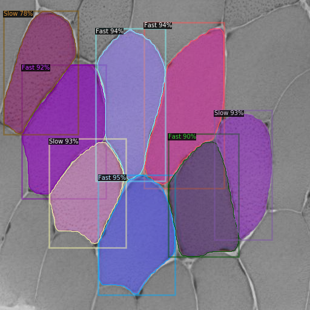

# Genopole Hackathon - Mouse Cell Labeling Tool

## Overview

This project was developed during the first edition of the [Genopole hackathon](https://www.genopole.fr/temps-forts/agenda/d4gen-hackathon-2022/) from May 19 to 21, 2021. Our team created a tool to label mouse cells into two categories: **fast** and **slow** cells. By leveraging advanced computer vision techniques and machine learning models, our tool aims to facilitate the analysis of cell behavior in biological research.

## Technologies Used

- **OpenCV**: A powerful library for image processing and computer vision tasks, used for image manipulation and preprocessing.
- **Detectron2**: A state-of-the-art object detection and segmentation framework developed by Meta (formerly Facebook AI Research). This model was employed to detect and classify the mouse cells based on their speed.

## Features

- **Image Preprocessing**: The tool utilizes OpenCV for preprocessing images, enhancing their quality for better detection results.
- **Cell Detection**: Using Detectron2, the tool accurately identifies mouse cells within the images.
- **Labeling**: The detected cells are categorized into two classes: fast and slow cells, aiding in subsequent analysis.
